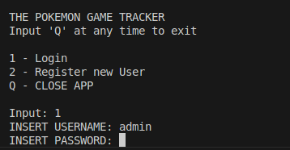

# COGNIXIA FUTURE HORIZONS CAPSTONE PROJECT<br>Pokemon Game Progress-Tracker

The following program tracks a user's completion status of various pokemon game based on how many pokemon they caught in each game. Users can also rate each title in their collection on a scale from 1 - 5. Users can choose from a list of up to 30 games to add to their collection to track.

## Table of Contents
- [Purpose](##Purpose)
- [Requirements](##Requirements)
- [Functions](##Functions)

## Purpose
This project was created as a part of Cognixia's Future Horizons upskilling course to demonstrate an intermediate understanding of Java and MySQL development. 

## Requirements
This project requires the following in order to run properly.
- app.config file
- A MySQL database
- Java Database Connectivity API

### Prequisites
A running MySQL database is required for this project to run correctly. The repository also contains a schema file in the root directory (`/game_db_schema.sql`) to create the necessary table structure for the project. An additional file `/game_db_data.sql` is also provided to add a default list of games, users, and game entries for the project's use.

#### ER-Diagram (For reference)


### Setup
Before running this project, the user must create an app.config file, containing the credentials for the database.

The file `/game-tracker/app.config.template` acts as a guideline for how this file should be formatted. The .config file must contain the url, username, and password for the associated database in the following format (exclude brackets).

```
database_url=jdbc:mysql://[url]
username=[username]
password=[password]
```

### Running
**NOTE:** This project has *only* been used and tested with VS-Code's built-in 'run Java' function.

To run this program, simply click the 'run Java' function while the `game_tracker/src/main/java/com/cognixia/fh/App.java` file is open.

## Functions
When the program is run, a user is able to do the following.
- Create an account and log in with a username and password
- Register and remove a game on their list
- View and edit a list of registered games, with 3 filtering options for completion status.

### Start-up
All actions within the project are done using the terminal window.Each command is executed by typing the associated key listed to the left of each action


> #### EXAMPLE:
> In the above screenshot, the user is given the option to either login, register a new account, or close the program.
>
> To login, a user would enter '1' in the terminal window and follow the prompts to login. Likewise, a user looking to create a new account would simply type '2' to recieve the prompts for creating a new account.
> 
> 

The above instructions hold true for all other menus within the project. 

From all the Main Menu, the user has the option to register a game to their collection, or edit the status of a game they have previously registered.

 

### Registering a new game
By typing '1' in the main menu, the user can register a new game to their collection. The user will be shown a list of up to 5 games they do *not* have currently registered. By entering one of the above numbers, the associated game will be added to that user's current collection.


Due to the large number of games within the database, these games are only displayed in groups of 5 at a time. To view the next five available games, the user can type 'N' to flip to the next "page."


> For more convenient viewing, a user can filter the list of unregistered games by their release generation (Option 'F').
>
> A game's generation typically describes the period of time in which it was released. The lower a game's generation is, the older that game is. Additionally, a game with a higher generation is more likely to have a higher number of total Pokemon to catch.

### Viewing Your Collection
The user can view a list of games they own by typing '2' on the main menu.

> Options 3, 4, and 5 will also show the user's list of games, filtered by their completion status.
>
> A game's completion status is determined by the total number of Pokemon they have caught in-game relative to that game's total number of Pokemon. 
> A game is considered **complete** when they have caught a number of Pokemon *equal* to that game's total number of Pokemon. 
> If the user has not caught *any* Pokemon in a given game, that game is considered **unopened/not started**. 
> For any number in between, that game is considered **in-progress**.


### Editing a game
When the user has selected a game, they can edit either the total number of Pokemon they have caught, or their individual rating for the title. Alternatively, they can chose to delete the entry from their collection entirely.

